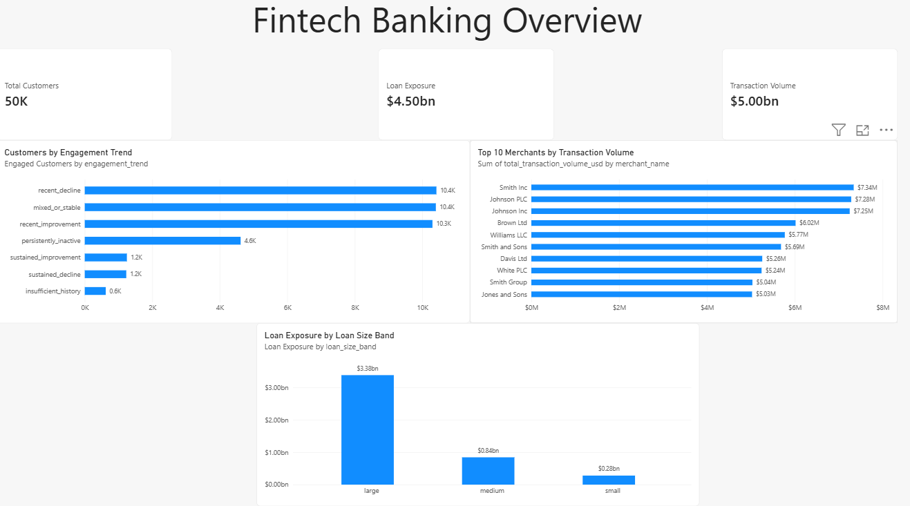
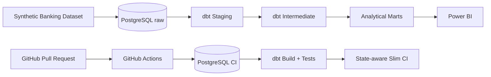

# Fintech Banking Analytics Engineering

An end-to-end Analytics Engineering project built with **PostgreSQL, dbt Core, GitHub Actions, and Power BI**.

The project transforms **1.26M synthetic banking records** into tested and documented analytical models for customer relationships, engagement, lending exposure, transactions, and merchant performance.

The focus is the engineering layer behind analytics: **data modeling, reusable SQL transformations, testing, documentation, CI/CD, and trusted downstream marts**.



---

## Architecture



---

## Project Highlights

* **1,260,500 source records**
* **18 dbt models**
* **178 data tests**
* Unit tests for selected business logic
* Custom generic tests and Jinja macros
* dbt contracts, documentation, lineage, analysis, and exposure
* PostgreSQL-backed **GitHub Actions CI**
* State-aware **Slim CI** using `state:modified+` and `--defer`
* Power BI consuming final dbt marts

---

## Business Questions

The project models questions such as:

* What products does each customer hold?
* What is each customer's total banking relationship?
* How much lending exposure exists per customer?
* How active are customers transactionally?
* Is customer engagement improving or declining?
* Which customers are persistently inactive?
* Which merchants generate the highest transaction volume?
* How is loan exposure distributed across loan-size segments?

Business logic is modeled primarily in **dbt**, keeping Power BI focused on presentation rather than rebuilding transformation logic.

---

## Dataset

The project uses the Kaggle **Synthetic Banking Dataset**.

| Source       |          Rows |
| ------------ | ------------: |
| Customers    |        50,000 |
| Accounts     |        75,000 |
| Cards        |       100,000 |
| Loans        |        30,000 |
| Merchants    |         5,000 |
| Branches     |           500 |
| Transactions |     1,000,000 |
| **Total**    | **1,260,500** |

Dataset:
https://www.kaggle.com/datasets/akrambelha/synthetic-banking-dataset-csv-sql-sqlite

The source data is loaded into PostgreSQL under the `raw` schema.

```text
customers
    ├──< accounts
    │       ├──< cards
    │       └──< transactions >── merchants
    └──< loans

branches
```

`branches` is standalone in the supplied dataset, so no unsupported relationship was created.

---

## dbt Modeling

The project follows a layered structure:

```text
Raw PostgreSQL
      ↓
Staging
      ↓
Intermediate
      ↓
Marts
      ↓
Power BI
```

### Staging

Seven staging models provide clean interfaces over the raw sources while staying intentionally close to the original data.

Examples include:

`stg_customers`, `stg_accounts`, `stg_loans`, `stg_transactions`

### Intermediate

Reusable transformations handle customer-level aggregation and quarterly activity modeling.

Important models include:

* `int_customer_accounts`
* `int_customer_cards`
* `int_customer_loans`
* `int_customer_transactions`
* `int_quarters`
* `int_customer_quarterly_activity`

The quarterly activity model explicitly distinguishes:

```text
0     = known absence of activity
NULL  = metric is undefined
```

### Analytical Marts

#### `customer_relationship_summary`

One row per customer, combining account, card, loan, transaction, and product relationship metrics.

#### `customer_engagement_trends`

Classifies account-holding customers using recent quarterly activity into categories such as:

`recent_decline`, `sustained_improvement`, `persistently_inactive`, and `mixed_or_stable`.

The model uses SQL window functions including `row_number()` and `lag()`.

#### `fct_transactions`

One row per transaction, enriched with `customer_id` so downstream consumers do not need to repeatedly reconstruct the account-to-customer relationship.

#### `fct_loans`

One row per loan, including customer credit score and reusable loan-size classifications.

#### `dim_merchants`

One row per merchant with transaction count, volume, average transaction amount, and activity dates.

---

## Data Quality & Testing

Testing is part of the transformation design rather than a final manual step.

The project uses:

* `unique`
* `not_null`
* `relationships`
* `accepted_values`
* singular business-rule tests
* unit tests
* reusable custom generic tests

Custom generic tests include:

```text
positive
non_negative
between_values
less_than_or_equal_to_column
```

Repeated validation logic was refactored into reusable tests while business-specific rules remained standalone SQL tests.

---

## Reusable dbt Features

The project also uses:

* **Jinja and custom macros**
* `dbt_utils`
* model contracts
* dbt analyses
* dbt exposures
* generated documentation and lineage

A custom `to_binary_flag` macro is used to consistently convert logical conditions into analytical `0/1` flags.

---

## CI/CD

Pull requests are validated through **GitHub Actions**.

CI creates a temporary environment containing:

```text
GitHub Actions runner
        +
PostgreSQL 17
        +
dbt Core
```

A small banking fixture dataset is loaded into PostgreSQL so the workflow can actually execute models and tests rather than performing syntax validation only.

The CI workflow was intentionally tested with a broken SQL reference to verify that invalid changes fail before integration.

### Slim CI

The project also implements state-aware CI.

A baseline version of `main` is built into `ci_main`, while pull-request changes build into `ci_pr`.

dbt uses:

```bash
state:modified+
```

to identify changed models and downstream dependencies, together with:

```bash
--defer
```

to resolve unchanged upstream dependencies against the approved `main` environment.

This demonstrates a workflow designed to scale beyond rebuilding an entire dbt DAG for every change.

---

## Power BI

The final marts feed a lightweight Power BI dashboard containing:

**KPIs**

* Total Customers
* Transaction Volume
* Loan Exposure

**Visuals**

* Customers by Engagement Trend
* Loan Exposure by Loan Size Band
* Top 10 Merchants by Transaction Volume

Power BI intentionally contains minimal transformation logic:

```text
dbt      → transformation and business logic
Power BI → visualization and consumption
```
### Power BI Report

The final dbt marts are consumed by a lightweight Power BI dashboard.

[Download the Power BI report (.pbix)](powerbi/fintech_banking_dashboard.pbix)
---

## Key Engineering Decisions

**No artificial source relationships**
The standalone branch data was left disconnected rather than forcing an unsupported relationship.

**Reusable tests over duplicated SQL**
Repeated validation patterns were converted into generic tests.

**Real database CI**
GitHub Actions executes the project against PostgreSQL rather than relying only on parsing.

**No forced incremental models or snapshots**
The source dataset is static, so incremental processing, freshness monitoring, and snapshots would require manufacturing an artificial use case. Those techniques are better demonstrated on genuinely changing source data.

---

## Tech Stack

| Area            | Technology        |
| --------------- | ----------------- |
| Database        | PostgreSQL 17     |
| Transformation  | dbt Core 1.12.3   |
| Adapter         | dbt-postgres      |
| Language        | SQL / Jinja       |
| Package         | dbt-utils         |
| Version Control | Git / GitHub      |
| CI/CD           | GitHub Actions    |
| BI              | Power BI          |
| Development     | VS Code / Windows |

---

## Repository Structure

```text
fintech-banking-project/
├── .github/
│   ├── ci/
│   └── workflows/
├── analyses/
├── macros/
├── models/
│   ├── staging/
│   ├── intermediate/
│   └── marts/
├── tests/
├── assets/
│   └── fintech_banking_dashboard.png
├── powerbi/
│   └── fintech_banking_dashboard.pbix
├── dbt_project.yml
├── packages.yml
├── selectors.yml
└── README.md
```

---

## Running Locally

Install dependencies:

```bash
dbt deps
```

Validate the PostgreSQL connection:

```bash
dbt debug
```

Build and test the project:

```bash
dbt build
```

Generate dbt documentation:

```bash
dbt docs generate
dbt docs serve
```

---

## What This Project Demonstrates

This project demonstrates the workflow from **raw operational-style data to trusted analytical products**:

```text
Source analysis
      ↓
Business requirements
      ↓
Layered data modeling
      ↓
Reusable SQL transformations
      ↓
Automated testing
      ↓
Documentation and lineage
      ↓
Git + CI/CD
      ↓
Trusted marts
      ↓
Business intelligence
```
